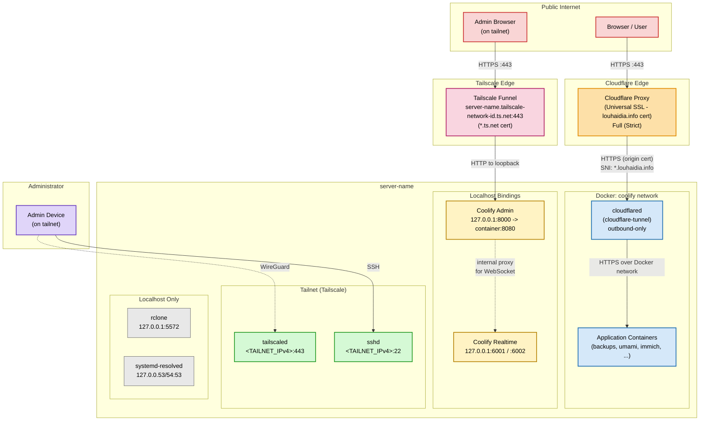
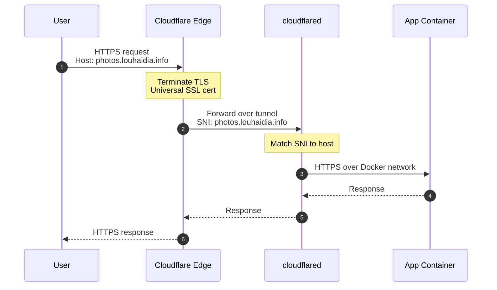
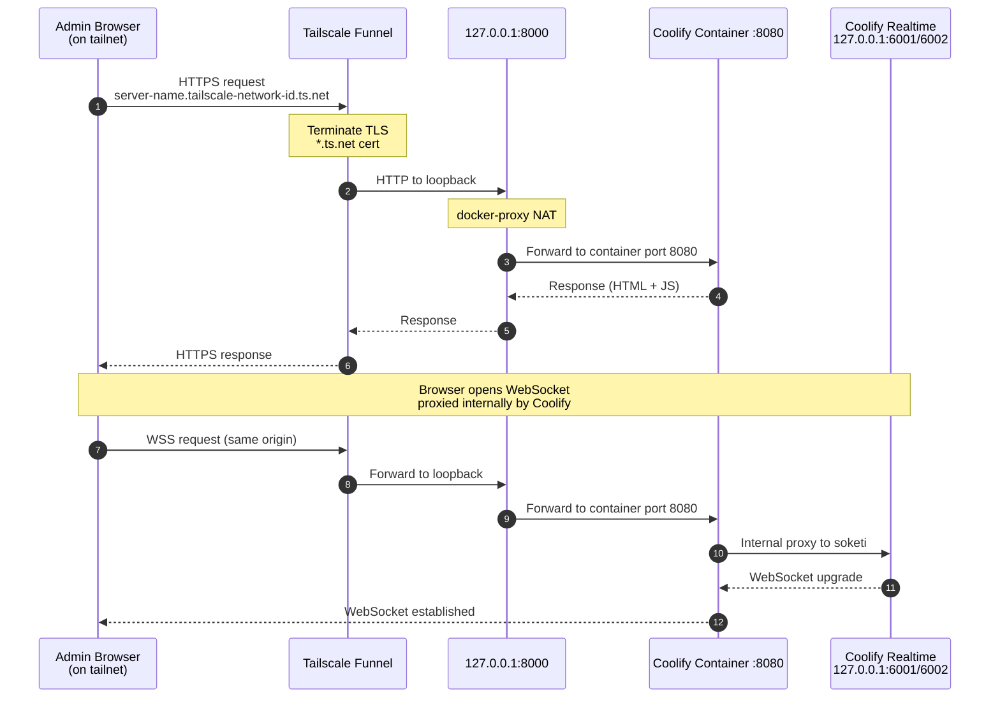
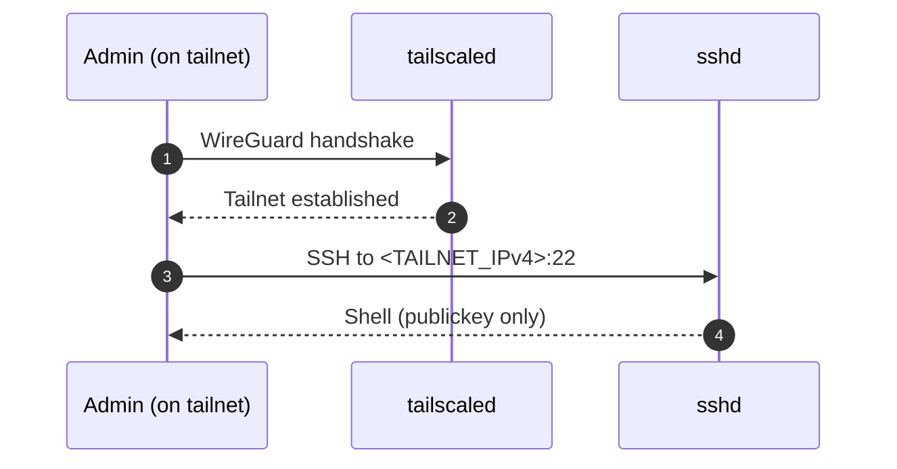
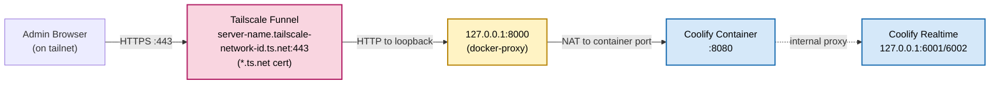

# architecture



> no inbound ports are exposed on the host's public interface. public https apps are served through cloudflare tunnel ; the coolify admin ui is exposed via tailscale funnel ; ssh is tailnet-only.

## public flows



## coolify admin ui



## ssh flow



## attack surface

we want to keep on the server no listening services on its public interface. we will be having a default firewall rule on the server that drops any incoming connection on any protocol. an attacker scanning the public ip would find every port filtered or closed. the only public entry points are the two tunnel endpoints (cloudflare tunnel for apps, tailscale for ssh and for the funnel that handles the coolify admin ui). both are outbound-initiated from the server. ssh is reachable only from authenticated tailnet devices and through authentication and short lived provisioned credentials. no ssh keys are needed.

# prerequisites

## tailscale

go to tailscale website and signup for a free account [here](https://tailscale.com/). when prompted to select an identity provider, choose what you are used to. i chose [github](https://github.com/). once you authorized tailscale to fetch some information from your identity provider, your tailnet is created.

the next step is to enroll your server in tailnet. you will need to run on your linux server:

```bash
curl -fsSL https://tailscale.com/install.sh | sh
sudo tailscale up --ssh
```

this command generates a node key pair and prompts you to authenticate via your chosen identity provider. the `--ssh` flag tells tailscale to advertise ssh capability for this device. you will see a url in the output. open this url in your browser to authenticate the server with your identity provider account. after successful authentication, the server will appear on the machines page of your tailscale admin console. tailscale never sees your identity provider password ; it uses oidc to verify your identity through github.

when you run `ssh your-server`, the tailscale client on your machine intercepts the connection. instead of using standard ssh keys, it establishes a connection over the wire-guard mesh network. tailscale's own ssh server on the destination device then authenticates you based on the rules in your tailscale config. the result is a secure, encrypted connection that is authorized centrally, without you ever managing a ssh key.

then you also need to define in access controls → policies the rules you want to apply to control access to ssh in the tunnel:

```json
{
	"src":    ["mota-lhd@github"], # the user authorized to run ssh
	"dst":    ["autogroup:self"], # the destination of the ssh command
	"users":  ["linux-user"], # to which users on the dst linux server the src has access
	"action": "check", # forces checking the authentication each 12 hours
}
```

then running the following command will run browser authentication and connect you to your server without managing any ssh keys.

```bash
ssh linux-user@server-name
```

# public flows

## why?

tailscale funnel could have been used as an ingress for custom-domain apps, but it terminates tls with a `*.ts.net` certificate only. it cannot present a certificate for `louhaidia.info`, which causes ssl handshake errors when a custom domain points at the funnel endpoint.

cloudflare tunnels solve this because cloudflare's edge serves the `louhaidia.info` certificate to clients and connects to the origin over a separate trusted path.

tailscale funnel will be used only for the coolify admin app, which is accessed through its native `*.ts.net` hostname. no custom domain is involved there, so there is no certificate mismatch.

## cloudflare in coolify

to implement cloudflare on coolify server, we create a new coolify service (using the template) with the following docker-compose file.

```yaml
services:

  cloudflared:
    container_name: cloudflare-tunnel
    image: 'cloudflare/cloudflared:latest'
    restart: unless-stopped
    command: 'tunnel --protocol http2 --no-autoupdate run'
    environment:
      - 'TUNNEL_TOKEN=${CLOUDFLARE_TUNNEL_TOKEN}'
    healthcheck:
      test: [CMD, cloudflared, '--version']
      interval: 5s
      timeout: 20s
      retries: 10
    networks:
      - coolify

networks:
  coolify:
    external: true
```

> do not set `network_mode: host`. the container must be on the `coolify` network so docker's embedded dns can resolve backend service names.

> do not publish any ports. the tunnel is outbound-only.

> the token is stored in .env.

## routes in cloudflare tunnel

after creating a free account in cloudflare, you will need to configure in cloudflare dashboard → **networks → tunnels** a new tunnel and then afterwards go into the newly created tunnel settings to create a new route.

| **subdomain** | **domain** | **service url** | **sni setting** |
|-----------|--------|-------------|-------------|
| `restricted` | `louhaidia.info` | `https://<backend>:443` | `Match SNI to host = Enabled` |
| `*`       | `louhaidia.info` | `https://<backend>:443` | `Match SNI to host = Enabled` |

replace `<backend>` with the container name of the service that terminates tls for your apps (e.g. the coolify proxy container on the `coolify` network). you can publish everything on the wildcard subdomain if you intend to have no controls on the published apps. i keep the restricted sub domain to showcase how we can put an identity aware proxy in front to not open publicly some apps on coolify. this can be useful for n8n for example and will be the topic of the next blog post 😀.

> match sni to host is required so `cloudflared` forwards the original hostname (e.g. `photos.louhaidia.info`) as the tls sni to the backend, allowing wildcard certificate matching.

## **origin certificate**

### **certificate creation**

in cloudflare dashboard → **SSL/TLS → Origin Server → Create Certificate**:

* Key type: **RSA (2048)**
* Hostnames: `louhaidia.info`, `*.louhaidia.info`
* Validity: **15 years**

> **free-plan limitation:** \*.louhaidia.info covers exactly one level of subdomain. [deep.sub.louhaidia.info](http://deep.sub.louhaidia.info) requires Advanced Certificate Manager.

### **certificate installation**

files placed on the host **inside the data volume of the TLS-terminating container**, which is mapped into that container at `/data/`:

```bash
chmod 644 /path/to/caddy/configs/data/certs/louhaidia.info.cert
chmod 600 /path/to/caddy/configs/data/certs/louhaidia.info.key
```

### **dynamic tls config**

```bash
# file in /path/to/caddy/configs/dynamic/louhaidia-origin.caddy

(cloudflare_origin) {
    tls /data/certs/louhaidia.info.cert /data/certs/louhaidia.info.key
}

*.louhaidia.info {
    import cloudflare_origin
}

louhaidia.info {
    import cloudflare_origin
}
```

then you need to reload the proxy config using the following command

```bash
docker exec coolify-proxy \
       caddy reload --adapter caddyfile \
                    --config /config/caddy/Caddyfile.autosave
```

## cloudflare settings

| **Setting** | **Location** | **Value** |
|---------|----------|-------|
| SSL/TLS encryption mode | SSL/TLS → Overview | Full (Strict) |
| Always Use HTTPS | SSL/TLS → Edge Certificates | Enabled |
| Wildcard CNAME | DNS      | `*.louhaidia.info` → `<TUNNEL_UUID>.cfargotunnel.com` (proxied) |

> full (strict) is mandatory now that the origin presents a real, cloudflare-trusted certificate.

> the wildcard cname is created automatically when the route is created within the tunnel.

# coolify admin ui

the coolify admin ui is exposed publicly through tailscale funnel at the server's native tailnet hostname. this is separate from the cloudflare tunnel path, which handles the `louhaidia.info` apps.

## how?



funnel only accepts loopback targets (`127.0.0.1` / `localhost`). this is a deliberate tailscale security measure as it prevents funnel from being used to expose arbitrary services on local network. all coolify services are therefore bound to `127.0.0.1` on the host.

coolify container proxies web-socket traffic internally to the realtime service, so the browser only needs to reach the funnel https url on port 443. no additional public ports are exposed.

## ports' bindings

first create a customization file for coolify docker-compose in `/data/coolify/source/docker-compose.custom.yml`

```yaml
services:
  coolify:
    ports: !override
    - "127.0.0.1:8000:8080"
  soketi:
    ports: !override
    - "127.0.0.1:6001:6001"
    - "127.0.0.1:6002:6002"
```

to apply this change, run the upgrade script.

```bash
/data/coolify/source/upgrade.sh
```

## **funnel command**

run as `root`:

```bash
tailscale funnel reset
tailscale funnel --bg 8000
tailscale funnel status
```

# ssh flow

first you need to bind the port ssh listens on to the tailnet ip address. to perform this, you can create a new customization config file at `/etc/ssh/sshd_config.d/hardening.conf` with the following contents.

```none
ListenAddress <TAILNET_IPv4>
ListenAddress <TAILNET_IPv6>
```

> this file permissions must be 644 and owned by root:root. sshd silently ignores files that are group or world writable.

The main `/etc/ssh/sshd_config` needs the directory include.

```none
Include /etc/ssh/sshd_config.d/*.conf
...
```

> the Include must appear before any ListenAddress in the main config. sshd uses first-match-wins.

# conclusion

we hardened the server from the public edge to the operating system. we managed to have no inbound ports on its public interface. public apps are served through cloudflare tunnel (outbound-only), the coolify admin ui through tailscale funnel and ssh is tailnet-only. all coolify services are bound to 127.0.0.1. the result: no 0.0.0.0 listeners, two outbound-initiated public entry points and a verifiable security posture.

next we will cover the east-west boundary inside docker. in the next article in this series, we'll discuss network segmentation between services on coolify network using docker networking, splitting the flat shared bridge into isolated segments so containers only reach the peers they need. that completes the hardening story.
