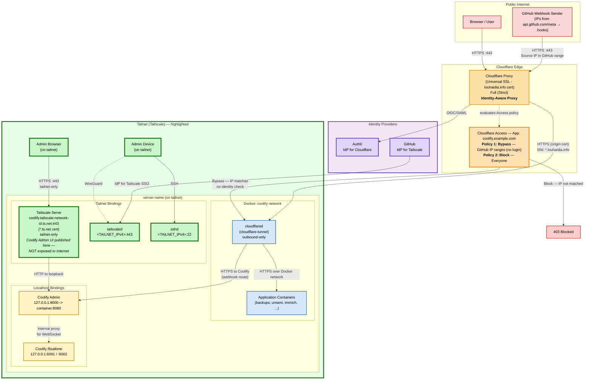
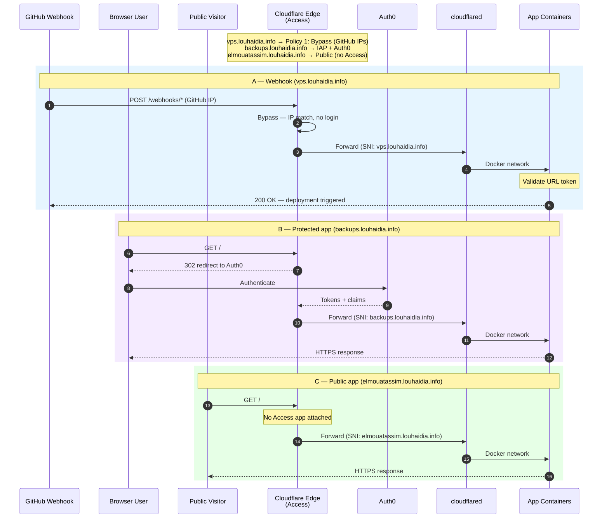
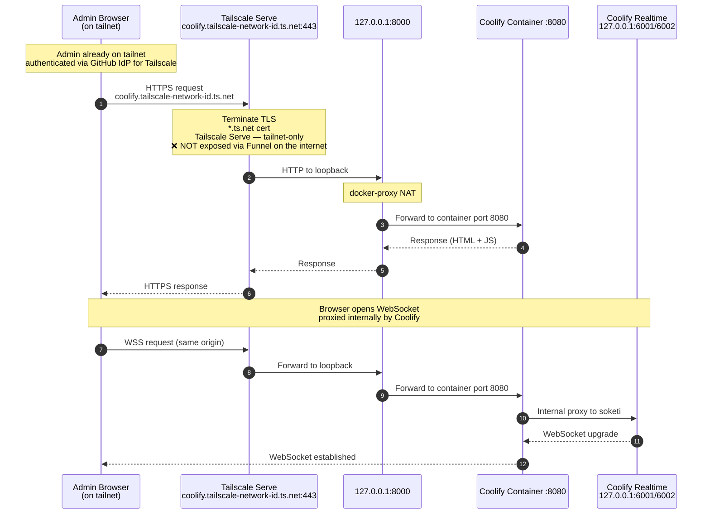
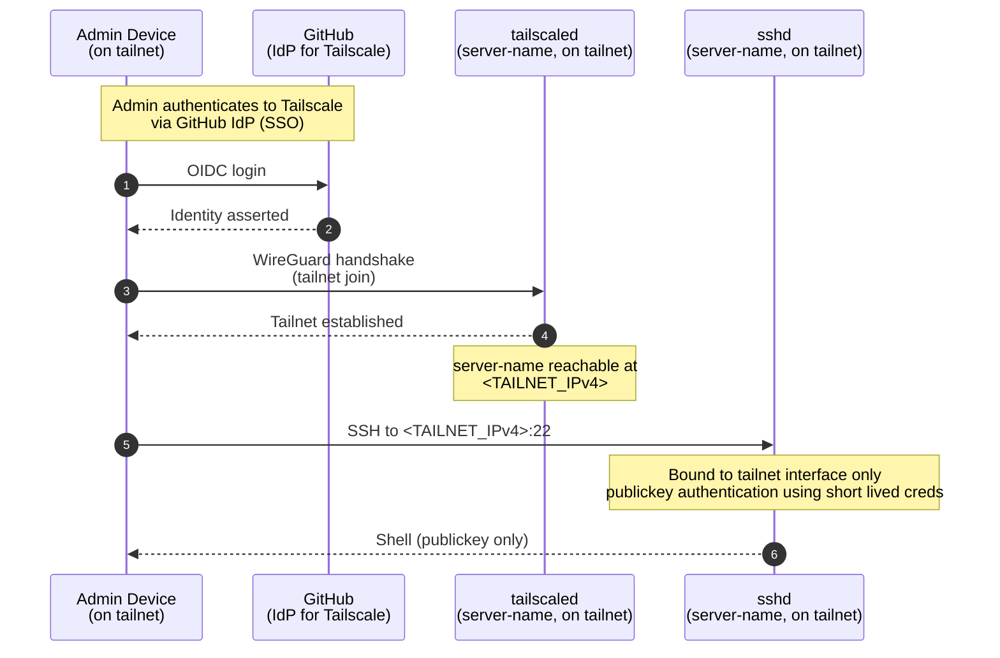
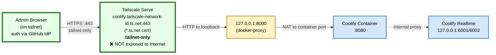
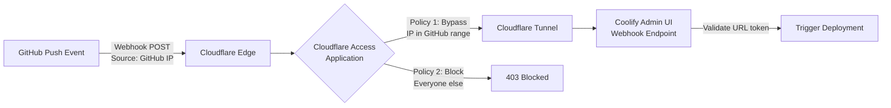

## architecture

the general architecture we are aiming for is illustrated in the diagram below. this architecture uses zero trust principles and reduces the attack surface to a minimum by keeping on the server no listening services on its public interface. we will be having a default firewall rule on the server that drops any incoming connection on any protocol. an attacker scanning the public ip would find every port filtered or closed. the only public entry points are the two tunnel endpoints (cloudflare tunnel for apps, tailscale for ssh and for the https-serve that handles the coolify admin ui). both are outbound-initiated from the server. ssh is reachable only from authenticated tailnet devices and through authentication and short lived provisioned credentials. no ssh keys are needed to be managed by end users.



> no inbound ports are exposed on the host's public interface. public https apps are served through cloudflare tunnel ; the coolify admin ui is exposed via tailscale serve command and only within the tailscale network. ssh is also available only on tailscale network.

### sequence diagrams

a user who is using publicly available apps hosted on coolify will go through the following sequence. some apps will be available after passing the identity aware proxy in cloudflare (like backups, automations, etc.). some others will be available directly. we will have also a path dedicated to github webhooks where access policies are bypassed after checking the source ip address of the sender.



this following diagram illustrates the steps an admin will go through in order to access the coolify admin dashboard. as this interface is highly sensitive, it is published only on tailscale network and not exposed on the internet.



the last sequence diagram is to visualize the steps in place to authenticate using ssh protocol from a trusted device on the tailnet network.



## tailscale

[go to tailscale](https://tailscale.com/) website and signup for a free account. when prompted to select an identity provider, choose what you are used to. i chose [github](https://github.com/). once you authorized tailscale to fetch some information from your identity provider, your tailnet is created.

the next step is to enroll your server in tailnet. you will need to run on your linux server:

```bash
curl -fsSL https://tailscale.com/install.sh | sh
sudo tailscale up --ssh
```

this command generates a node key pair and prompts you to authenticate via your chosen identity provider. the `--ssh` flag tells tailscale to advertise ssh capability for this device. you will see a url in the output. open this url in your browser to authenticate the server with your identity provider account. after successful authentication, the server will appear on the machines page of your tailscale admin console. tailscale never sees your identity provider password ; it uses oidc to verify your identity through github.

when you run `ssh your-server`, the tailscale client on your machine intercepts the connection. instead of using standard ssh keys, it establishes a connection over the wire-guard mesh network. tailscale's own ssh server on the destination device then authenticates you based on the rules in your tailscale config. the result is a secure, encrypted connection that is authorized centrally, without you ever managing a ssh key.

you also need to define in access controls → policies the rules you want to apply to control access to ssh in the tunnel. first you need to define the general acl:

```json
    {
        "src": ["mota-lhd@github"],
        "dst": ["tag:vps"],
        "ip":  ["tcp:22"],
    }
```

then the specific rule for ssh:

```json
{
 "src":    ["mota-lhd@github"], // the user authorized to run ssh
 "dst":    ["tag:vps"],         // the destination of the ssh command
 "users":  ["linux-user"],      // which users on dst linux server the src has access to
 "action": "check",             // forces checking the authentication each 12 hours
}
```

you also need to make sure that ssh listens on to the tailnet ip address. to perform this, you can create a new customization config on your server by adding the following file at `/etc/ssh/sshd_config.d/hardening.conf` with these contents.

```none
ListenAddress <TAILNET_IPv4>
ListenAddress <TAILNET_IPv6>
```

> this file permissions must be 644 and owned by root:root. sshd silently ignores files that are group or world writable.

The main `/etc/ssh/sshd_config` needs the directory include.

```none
Include /etc/ssh/sshd_config.d/*.conf
...
```

> the Include must appear before any ListenAddress in the main config. sshd uses first-match-wins.

then running the following command will run browser authentication and connect you to your server without managing any ssh keys.

```bash
ssh linux-user@server-name
```

## cloudflare

### why?

tailscale funnel feature could have been used as an ingress for custom-domain apps to publish them on the internet. the problem is that it terminates tls with a `*.ts.net` certificate only. it cannot present a certificate for `louhaidia.info`, which causes ssl handshake errors when a custom domain points at the funnel endpoint.

cloudflare tunnels solve this because cloudflare's edge serves the `louhaidia.info` certificate to clients and connects to the origin over a separate trusted path.

### cloudflare daemon

to implement cloudflare on coolify server, we create a new coolify service (using the template) with the following docker-compose file.

```yaml
services:

  cloudflared:
    container_name: cloudflare-tunnel
    image: 'cloudflare/cloudflared:latest'
    restart: unless-stopped
    command: 'tunnel --protocol http2 --no-autoupdate run'
    environment:
      - 'TUNNEL_TOKEN=${CLOUDFLARE_TUNNEL_TOKEN}'
    healthcheck:
      test: [CMD, cloudflared, '--version']
      interval: 5s
      timeout: 20s
      retries: 10
    networks:
      - coolify

networks:
  coolify:
    external: true
```

> do not set `network_mode: host`. the container must be on the `coolify` network so docker's embedded dns can resolve backend service names.

> do not publish any ports. the tunnel is outbound-only.

> the token is stored in .env.

### cloudflare tunnel

after creating a free account in cloudflare, you will need to configure in cloudflare dashboard → networks → tunnels a new tunnel and then afterwards go into the newly created tunnel settings to create two new routes. one to serve all apps hosted on your coolify from the internet and one to receive webhooks to deploy github sources. the order is important. start with the webhooks one as it goes to a different container.

| **subdomain** | **domain** | **path** | **service url** | **sni setting** |
| ----------- | -------- | -------- | ------------- | ------------- |
| `vps` | `louhaidia.info` | `^/webhooks/source/github/` | `http://coolify:8080` | `none as we are in clear-text world here` |
| `*` | `louhaidia.info` | `*` | `https://coolify-proxy:443` | `Match SNI to host = Enabled` |

> match sni to host is required so `cloudflared` forwards the original hostname (e.g. `photos.louhaidia.info`) as the tls sni to the backend, allowing wildcard certificate matching.

### origin certificate

we need to generate the ssl certificate we will use to serve apps from the coolify containers. in cloudflare dashboard → ssl/tls → origin server → create certificate:

* Key type: **RSA (2048)**
* Hostnames: `louhaidia.info`, `*.louhaidia.info`
* Validity: **15 years**

> **free-plan limitation:** \*.louhaidia.info covers exactly one level of subdomain. [deep.sub.louhaidia.info](http://deep.sub.louhaidia.info) requires Advanced Certificate Manager.

we then need to make our caddy reverse proxy use these files to terminate ssl/tls connections. files placed on the host **inside the data volume of the tls-terminating container**, which is mapped into that container at `/data/`:

```bash
chmod 644 /path/to/caddy/configs/data/certs/louhaidia.info.cert
chmod 600 /path/to/caddy/configs/data/certs/louhaidia.info.key
```

loading these files is done using a dynamic config in caddy that can be created using the coolify admin dashboard or using the terminal.

```bash
# file in /path/to/caddy/configs/dynamic/louhaidia-origin.caddy

(cloudflare_origin) {
    tls /data/certs/louhaidia.info.cert /data/certs/louhaidia.info.key
}

*.louhaidia.info {
    import cloudflare_origin
}

louhaidia.info {
    import cloudflare_origin
}
```

then you need to reload the proxy config using the following command

```bash
docker exec coolify-proxy \
       caddy reload --adapter caddyfile \
                    --config /config/caddy/Caddyfile.autosave
```

make sure you have also configured as follows these settings.

| **Setting** | **Location** | **Value** |
| --------- | ---------- | ------- |
| SSL/TLS encryption mode | SSL/TLS → Overview | Full (Strict) |
| Always Use HTTPS | SSL/TLS → Edge Certificates | Enabled |
| Wildcard CNAME | DNS | `*.louhaidia.info` → `<TUNNEL_UUID>.cfargotunnel.com` (proxied) |

> full (strict) is mandatory now that the origin presents a real, cloudflare-trusted certificate.

> the wildcard cname is created automatically when the route is created within the tunnel.

## coolify admin ui

the coolify admin ui is exposed on the tailscale local network through `tailscale serve`. this is separate from the cloudflare tunnel path, which handles the `louhaidia.info` apps.

### how?

the following sequence explains how this is performed in the background.



coolify container proxies web-socket traffic internally to the realtime service, so the browser only needs to reach the `serve` https url on port 443. no additional ports are exposed.

### coolify ports

first create a customization file for coolify docker-compose in `/data/coolify/source/docker-compose.custom.yml`

```yaml
services:
  coolify:
    ports: !override
    - "127.0.0.1:8000:8080"
  soketi:
    ports: !override
    - "127.0.0.1:6001:6001"
    - "127.0.0.1:6002:6002"
```

to apply this change, run the upgrade script.

```bash
/data/coolify/source/upgrade.sh
```

### serve command

first you would need to go to network -> services in tailscale admin ui and create a new service. let's call it coolify and this service will listen on tcp port 443.
then ssh into your server and run the following as `root`:

```bash
tailscale serve reset
# here svc:coolify will advertise the service using the previously created entity
tailscale serve --https 443 --service svc:coolify --bg http://127.0.0.1:8000
tailscale serve status
```

then to allow access to the newly created service available at `coolify.<tailnet-id>.ts.net` you would need to add the following in access controls -> policies.

```json
{
 "src": ["mota-lhd@github"],
 "dst": ["svc:coolify"],
 "ip":  ["tcp:443"],
}
```

### github webhooks

in order to protect your coolify admin ui, exposed via a cloudflare tunnel, so that only gitHub's webhook delivery ip ranges can reach it, we will use a `bypass` policy in cloudflare access, **not an `allow` policy**, so non-interactive webhook requests are never redirected to a login page.



> the webhook url already contains a secret token for authentication

you can actually get the ip ranges used by github to deliver webhooks using the following command line:

```bash
curl -s https://api.github.com/meta | jq '.hooks'
```

then create in zero-trust configs on cloudflare a self-hosted application with 2 policies:

1. bypass policy that is based only on source ip addresses
2. block policy that blocks everything else.

make sure to test it from github and from your local device (using burp or curl).

## conclusion

we hardened the server from the public edge to the server. we managed to have no inbound ports on its public interface. public apps are served through cloudflare tunnel (outbound-only), the coolify admin ui and ssh are published only on tailnet. all coolify services are bound to 127.0.0.1. the result: no 0.0.0.0 listeners, two outbound-initiated public entry points and a verifiable security posture.

in the next article in this series, we'll discuss network segmentation between services on coolify network using docker networking, splitting the flat shared bridge into isolated segments so containers only reach the peers they need. that and along with some docker security best practices will complete the hardening story.
